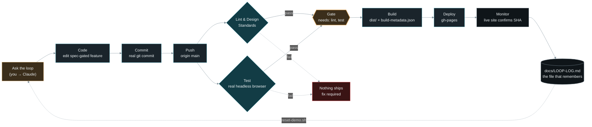

# Loop Engineering — Live Demo Companion

> Reference doc for the demo section of the talk. Everything below describes
> **this repository**, running live — not a mock. See `docs/LOOP-LOG.md` for
> the real commit/run history behind every claim here.

## Running order — two loops, one session

This repo now has two independent loops to show, back to back, as one
narrative arc (same reframe, same six parts, applied twice):

1. **Loop 1 — the feature loop** ("The loop, live" below): ask the loop to
   implement something, watch it go through the gate, watch it deploy.
2. **Loop 2 — the security loop** ("Second story: the security review
   loop" further down): the *same* loop shape, pointed at the CI pipeline
   itself instead of the app — with a real bug the loop caught in its own
   gate along the way, which is the strongest beat in either story.

Suggested order: run Loop 1 first (it's the more visual, more legible
"watch it build" moment), then pivot with *"now watch the same loop
pattern applied somewhere less obvious — hardening its own checks"* into
Loop 2. `docs/LOOP-LOG.md` is the single artifact that ties both
together at the end — real evidence for both stories in one file.

## The reframe, in one line

> "My job is to write loops." — Boris Cherny

A **prompt** asks for the next thing, does it, and stops — you judge it.
A **loop** names a condition and keeps going until it's true, or it runs out
of turns or money. This repo is one loop, running against a real GitHub
repo, that you can watch end to end.

## The six parts — and where each one lives in this repo

| Part (from the talk) | What it does | In this repo |
|---|---|---|
| Something that starts it | Wakes the loop up | You, asking Claude directly — or `push` / `workflow_dispatch` |
| Written-down rules | Conventions saved once, not re-explained every run | `specs/AIDLC-SPEC.md`, `specs/FEATURE-SPEC-realtime-feed.md` |
| Access to real tools | Reaches where the work actually lives | GitHub REST API, GitHub Actions, Celestrak, wheretheiss.at |
| A second, independent checker | Doesn't trust the writer's own judgment | **GitHub Actions** — `Lint & Design Standards` + `Test` jobs |
| The gate | Decides what's safe to ship | `needs: [lint, test]` — Build/Deploy literally cannot run if the checker disagrees |
| A file that remembers | Survives past the end of one conversation | `docs/LOOP-LOG.md` — real SHAs and run IDs, not a summary written after the fact |

Notice the checker here isn't a second LLM — it's deterministic tests and a
lint script. That's deliberate, and it's the same claim from the talk:
*"prefer checks a machine can settle — cheaper, and harder to argue with."*
`scripts/check-design-standards.js` and `tests/e2e.js` (a real headless-browser
run, not a mock DOM) are that check.

## The loop, live

Every box above is a real thing you can click on right now:

- **Ask** → you, live, in the terminal
- **Code / Commit / Push** → `git log` on `main`
- **Lint / Test** → [Actions tab](https://github.com/nishant7k/LoopEngineeringClaude/actions), real jobs, real durations
- **Gate** → the `needs:` line in [`.github/workflows/ci-cd.yml`](.github/workflows/ci-cd.yml) — not a metaphor, the actual YAML
- **Build / Deploy** → [gh-pages branch](https://github.com/nishant7k/LoopEngineeringClaude/tree/gh-pages)
- **Monitor** → [`loop-live.html`](https://nishant7k.github.io/LoopEngineeringClaude/loop-live.html), watching the same API you'd hit with `gh run list`
- **The loop-back** → `scripts/reset-demo.sh`, a real `git` revert-and-push, not a UI reset

## What to narrate live (three things, per the talk's own advice)

1. **The condition you typed** — say it out loud before you hit enter:
   *"implement the live ISS tracking feed"* (or whatever you're asking for
   that day). That sentence is the entire spec the loop needs.
2. **The checker disagreeing with the writer** — if you have time, this
   really happened tonight: a CI step hung on `npm install` for three
   minutes straight before the fix landed. The checker didn't wave it
   through because a human wanted it to work — it kept failing until the
   actual cause (`npm`'s audit/funding calls) was found and removed. That's
   the "never let it mark its own homework" line, live, with a timestamp.
3. **The state file afterwards** — open `docs/LOOP-LOG.md` and show that
   the SHAs and run IDs in it are the same ones just seen in the Actions
   tab. Nothing was written after the fact to look tidy.

## Fallback

Per the deck: *if it stalls, cut to the recording immediately — don't
debug on stage.* `monitoring.html` shows the real Actions history
regardless of whether a live trigger is running; `before-after.html` is
accurate as static snapshots without needing a live toggle at all.

---

## Second story: the security review loop

> Adapted from Figma's ["How Figma stays ahead of vulnerabilities with
> agents"](https://www.figma.com/blog/how-figma-stays-ahead-of-vulnerabilities-with-agents/) —
> full rationale in `specs/FEATURE-SPEC-security-loop.md`. Same loop
> shape as above, pointed at the CI pipeline instead of the app.

### The six parts, this time for security

| Part (from the talk) | What it does | In this repo |
|---|---|---|
| Something that starts it | Wakes the loop up | Any PR against `main` |
| Written-down rules | Institutional reasoning, not re-litigated every scan | [`SECURITY-POLICY.md`](../SECURITY-POLICY.md) — precedents, not generic rules |
| Access to real tools | Reaches where the work actually lives | `anthropics/claude-code-security-review`, reading the real diff |
| A second, independent checker | Doesn't trust the writer's own judgment | The `security` job in `.github/workflows/security-review.yml` |
| The gate | Decides what's safe to ship | Branch protection on `main` — `security` + `Test` both required |
| A file that remembers | Survives past the end of one conversation | `docs/LOOP-LOG.md`'s security-loop section + run-history table |

The loop-back this time isn't a human editing the policy from memory —
it's `.github/workflows/security-policy-update.yml`: a `/security-fp
<reason>` PR comment appends a new precedent and opens a PR against
`main` with that change. The policy improves from real disputes, not
from someone remembering to update a doc.

### What to narrate live

1. **The condition** — open a PR (even a trivial one) and say out loud:
   *"every PR here gets a real AI security review before it can merge."*
2. **The checker disagreeing with the writer — a true story, already on
   the record.** This isn't hypothetical: PR #1 in this repo's own
   history merged with a `security` check that reported `pass` in
   **16 seconds** — but its own log reads *"ClaudeCode has already run on
   PR #1 (found marker file), forcing disable to avoid false
   positives."* A failed first attempt (missing API key) got cached as
   "already ran," and the retry silently skipped scanning. Open
   [run 34271699196](https://github.com/nishant7k/LoopEngineeringClaude/actions/runs/34271699196)
   live and read that line out loud — then show
   [run 34272199324](https://github.com/nishant7k/LoopEngineeringClaude/actions/runs/34272199324),
   the real scan once the key was fixed, at 57s. **A real scan on this
   repo takes 50s to 3 minutes, never ~15 seconds** — that gap is now
   documented as the manual tell in both `monitoring.html` and
   `docs/LOOP-LOG.md`. This is the single best "never let it mark its
   own homework" moment in either loop, because it's not staged — it's
   what actually happened while building this.
3. **The state file afterwards** — `docs/LOOP-LOG.md`'s "Security review
   loop" section: real PR numbers, real commit SHAs, real run IDs and
   durations for every iteration, plus the run-history table showing the
   16s-fake-pass vs. 53s+-real-scan contrast side by side.

If time allows, a fourth beat: comment `/security-fp <reason>` on any
open PR and watch `security-policy-update.yml` open a new PR against
`SECURITY-POLICY.md` live — the loop editing its own rules.

### Fallback

Same rule as Loop 1: don't debug a stalled Action live.
`monitoring.html`'s "Security review loop" panel (real pass/fail counts
against the real GitHub API) and `docs/LOOP-LOG.md`'s run-history table
both work as static evidence without triggering anything new.
